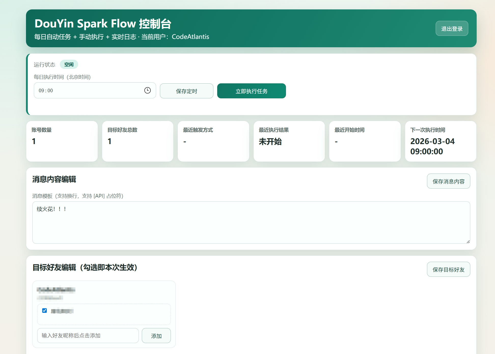
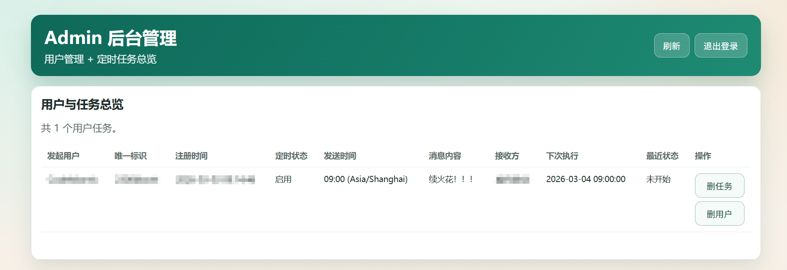
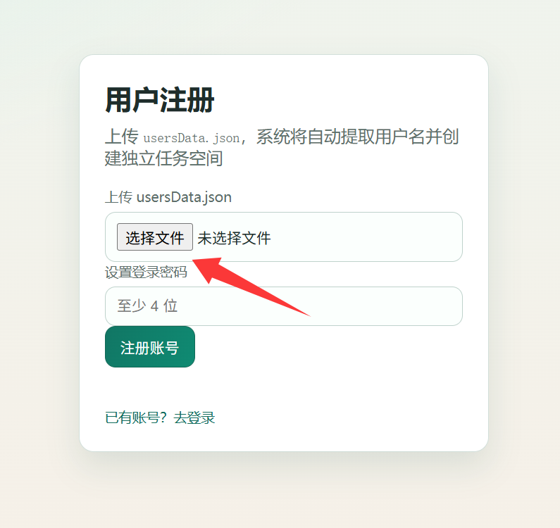
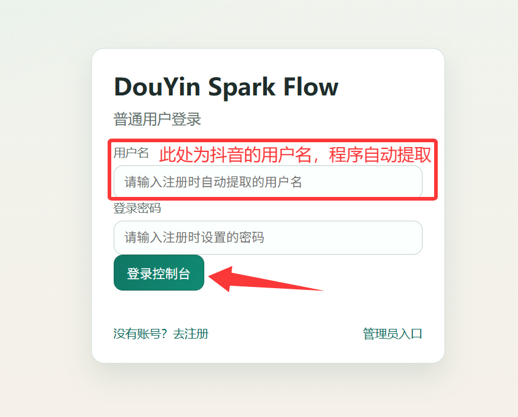

# DouYin Spark Helper

可以部署在HF space中的抖音自动续火花工具，项目部分代码参考[DouYinSparkFlow](https://github.com/2061360308/DouYinSparkFlow)

项目特点：
- 1.可以进行多账户定时运行
- 2.带有美观的管理界面
- 3.支持用户轻松设置发送目标和发送内容，轻松设置续火花的时间

## 部署方式

将本仓库所有内容（不含本README.md文件）上传至Huggingface Space中，在环境变量中设置PASSWORD环境变量（为保证安全请使用secect）

部署后在space中打开，然后可选择普通用户登录和Admin用户登录

## 使用方式

请先使用[DouYinSparkFlow](https://github.com/2061360308/DouYinSparkFlow)此项目，运行`main.py`，然后再本项目内上传需要的userData.josn文件注册普通账户使用（后续版本可能会融合一键登录部分，敬请期待）
#### 注册用户

#### 用户登录

#### Admin管理
